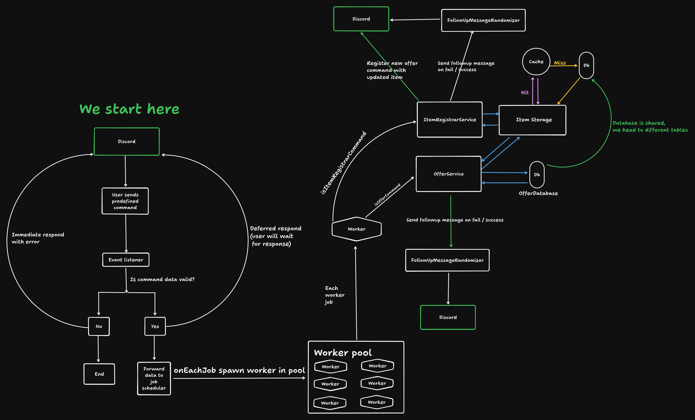

## Trader Bot

* Bot for trading items
```
Want to create market for your discord? 

Would you like to declare what items ppl will trading on your server?

In this type of implementation, discord server / guild **administrator**,
needs to register items for which users can create offers with **/item-register**
command. Users can create offers with items other than **administrator** registered.

You can declare up to 25 items.
Items will be shown when user will write a command as a drop/down list tooltip.

There is also rate limit for registering commands per guild, so be cautious.
When writing this project limit is **200** and resets after 24h.
```
* Actual supported commands:
```
    /item-register
        add {itemName} --- Register new item with *{name}*
        remove {itemName} --- Remove registered item with *{name}*
        list --- List all registered items (up to 25)
    /offer sell
        add {itemName}, {count}, {pricePerEachItem} 
            --- Add new sell offer for *{itemName}*, count *{count}*, priceForEach *{pricePerEachItem}*
                (if offer exists, therefore its count / price if updated)
        remove {itemName}, {pricePerEachItem} 
            --- Remove sell offer (only mine) with *{itemName}*, *{priceForEach}*
        update-price {itemName}, {pricePerEachItem}, {updatePrice}
            --- Update sell offer price with *{itemName}*, *{pricePerEachItem}*, *{update-price}* 
            (offer to update determined by name, and price for each)
        update-count {itemName}, {pricePerEachItem}, {updateCount}
            --- Update sell offer count with *{itemName}*, *{pricePerEachItem}*, *{update-count}* 
            (offer to update determined by name, and price for each)
        list-for-name {itemName}
            --- List all offers with *{itemName}*
        list-mine
            --- List all mine offers

    /offer buy --- For each command description head to /offer sell (acts the same)
        add {itemName}, {count}, {pricePerEachItem}
        remove {itemName}, {pricePerEachItem}
        update-price {itemName}, {pricePerEachItem}, {updatePrice}
        update-count {itemName}, {pricePerEachItem}, {updateCount}
        list-for-name {itemName}
        list-mine
```
---

## Project overview



--- 

## How to run project

### Prerequisities:

* Installed docker

* Installed ```make``` utility tool (not required, but preferred)

* Required environment variables:

    * You can create all needed env template files with ```make quick-setup```

    * Or ```chmod +x quick_env_setup && ./quick_env_setup```

    * Or manually, described below:
```
**File:** .app.env

**Content**
GUILD_ID=
APPLICATION_ID=
BOT_TOKEN=
PUBLIC_KEY=
**EOF Content**

**File:** .db.name

**Content**
random
**EOF Content**

**File:** .db.password

**Content**
random
**EOF Content**

**File:** .db.user

**Content**
random
**EOF Content**
```
---

* Description of all needed environment variables / its content:
    ***.app.env***

    * In **DEV** environment, application commands are registered in **guild**, 
      therefore the **GUILD_ID** environment is **required** 
      and **WITH_ITEM_REGISTRAR_COMMAND_REGISTER=true** ONLY IF 
      you want to register item registrar command on start. 
      You should specify it once, then set it to false,
      because there is rate limit for registering commands on discord.

    * In **PROD** environment, application commands are registered **globally**,
      therefore the **GUILD_ID** environment is **NOT** required.
    
    * **APPLICATION_ID, BOT_TOKEN, PUBLIC_KEY** are environment variables
    provided by **Discord**. 
    Head to *discord developer portal* and create app in order to obtain it.

    * **GUILD_ID** is also obtainable from **Discord**, but from *server* where app is installed.

    ***.db.name***

    * Provides database name for db provider via docker secret

    ***.db.password***

    * Provides database password for db provider via docker secret

    ***.db.user***

    * Provides database user for db provider via docker secret

---

### Running

* Via ```make```

    * ```make build-debug``` Debug run-time environment

    * ```make build-prod``` Prod run-time environment

* Via ```docker compose```

    * ```docker compose -f compose.dev.yaml up -d``` Debug run-time environment

    * ```docker compose -f compose.prod.yaml up -d``` Prod run-time environment
